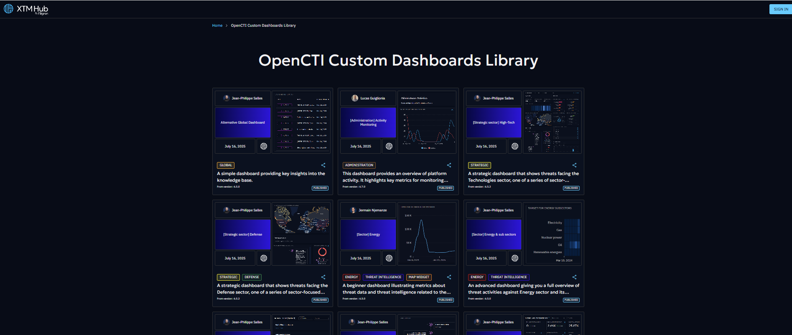
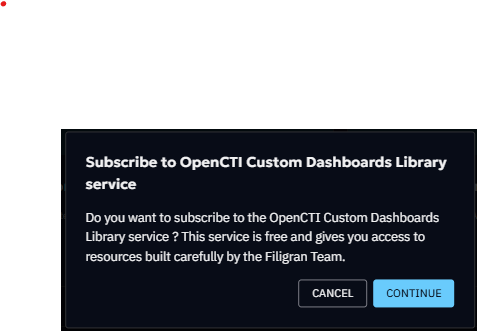

# OpenCTI Custom Dashboards Library

A comprehensive library of custom dashboards is now available on the XTM Hub,
providing seamless access to curated threat intelligence data.
Currently, the library focuses on custom dashboards that can be directly deployed to OpenCTI platforms and created by our Filigran Team.



## Overview
The XTM Hub custom dashboards library represents a significant advancement in threat intelligence accessibility.
The library features pre-built custom dashboards that have been curated by the Filigran team,
ensuring high-quality, relevant threat intelligence data.
Organizations can benefit from one-click deployment capabilities that integrate directly with registered OpenCTI platforms,
while maintaining completely free access without any cost barriers.
Additionally, the platform supports public browsing, allowing users to explore available dashboards without requiring authentication.

## Getting Started
### Initial Subscription
Before accessing the full functionality of the custom dashboards library,
your organization must complete a one-time subscription process.
A designated person from your organization needs to subscribe to the library,
which is completely free and serves as an enablement step for all subsequent users.
Once this initial subscription is completed, all users from your organization will
gain automatic access to the full range of services without any additional steps or recurring costs.




### Accessing the Library
The XTM Hub provides two distinct access methods to accommodate different user needs.
Authenticated access offers the complete feature set,
including the ability to browse and download custom dashboards,
deploy custom dashboards directly to OpenCTI platforms,
and access detailed feed information and metadata.
For users who prefer to explore before committing,
public access provides read-only capabilities through the cybersecurity-solutions portal,
where the complete library catalog can be viewed along with feed descriptions and
details without requiring any connection or subscription.

## Working with CSV Feeds
### Feed Exploration
The XTM Hub provides comprehensive information when you interact with any custom dashboard tile in the library.
Each dashboard includes detailed specifications and content descriptions to help you make informed decisions about integration.
Download options are readily available for users who prefer manual import processes,
while sharing capability allow you to generate shareable links that facilitate easy
collaboration with team members and external partners.

### Manual Import to OpenCTI
Organizations that prefer traditional import methods can
easily download desired custom dashboards from the library and manually integrate them
into their OpenCTI platforms. This process involves downloading the custom dashboard file,
navigating to your OpenCTI platform, and using the standard Import functionality
to upload and configure the feed according to your specific requirements.

### One-Click Deployment
The streamlined deployment process represents the most efficient method for integrating library custom dashboards
into your OpenCTI platform (available from OpenCTI 6.7.10).
Before utilizing this functionality, your OpenCTI platform must be properly registered in the XTM Hub (see  [OpenCTI registration documentation](/user/opencti-registration)),
and your user account must possess the necessary UPDATE and CREATE permissions for custom dashboards within OpenCTI.
The deployment process is straightforward: select your desired custom dashboard, click the ```Deploy on OpenCTI``` button,
choose your target platform if multiple platforms are registered,
and wait a few seconds until successful integration is confirmed in your OpenCTI platform. You will be redirected to the newly created dashboard. 

### Sharing and Collaboration
The XTM Hub facilitates seamless collaboration through its comprehensive sharing functionality.
Users can generate universal links for any cusotm dashboard, enabling cross-organization sharing with partners,
clients, or team members without requiring recipients to maintain XTM Hub accounts.
This approach removes barriers to information sharing while maintaining the integrity and
accessibility of threat intelligence data across different organizational boundaries.


## Technical Requirements and Best Practices
Successful integration with the XTM Hub requires attention to several technical considerations.
Users deploying dashboards must maintain appropriate OpenCTI permissions,
including UPDATE/CREATE capability for custom dashboards.
Platform registration involves enrolling OpenCTI platforms in the XTM Hub.