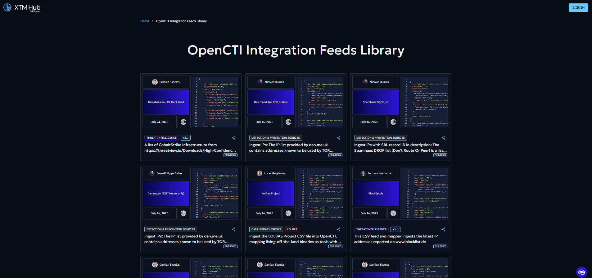
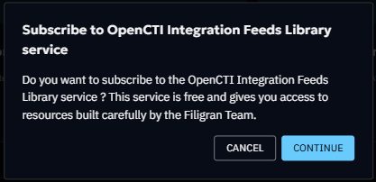

# OpenCTI Integration Feeds library

A comprehensive library of integration feeds is now available on the XTM Hub, 
providing seamless access to curated threat intelligence data. 
Currently, the library focuses on CSV Feeds that can be directly deployed to OpenCTI platforms and created by our Filigran Team.



## Overview
The XTM Hub integration feeds library represents a significant advancement in threat intelligence accessibility. 
The library features pre-built CSV Feeds that have been curated by the Filigran team, 
ensuring high-quality, relevant threat intelligence data.
Organizations can benefit from one-click deployment capabilities that integrate directly with registered OpenCTI platforms, 
while maintaining completely free access without any cost barriers. 
Additionally, the platform supports public browsing, allowing users to explore available feeds without requiring authentication.

## Getting Started
### Initial Subscription
Before accessing the full functionality of the integration feeds library, 
your organization must complete a one-time subscription process. 
A designated person from your organization needs to subscribe to the library, 
which is completely free and serves as an enablement step for all subsequent users. 
Once this initial subscription is completed, all users from your organization will 
gain automatic access to the full range of services without any additional steps or recurring costs.




### Accessing the Library
The XTM Hub provides two distinct access methods to accommodate different user needs. 
Authenticated access offers the complete feature set, 
including the ability to browse and download CSV Feeds, 
deploy feeds directly to OpenCTI platforms, 
and access detailed feed information and metadata. 
For users who prefer to explore before committing, 
public access provides read-only capabilities through the cybersecurity-solutions portal, 
where the complete library catalog can be viewed along with feed descriptions and 
details without requiring any connection or subscription.

## Working with CSV Feeds
### Feed Exploration
The XTM Hub provides comprehensive information when you interact with any CSV Feed tile in the library. 
Each feed includes detailed specifications and content descriptions to help you make informed decisions about integration. 
Download options are readily available for users who prefer manual import processes, 
while sharing capability allow you to generate shareable links that facilitate easy 
collaboration with team members and external partners.

### Manual Import to OpenCTI
Organizations that prefer traditional import methods can 
easily download desired CSV Feeds from the library and manually integrate them
into their OpenCTI platforms. This process involves downloading the CSV file, 
navigating to your OpenCTI platform, and using the standard Import functionality 
to upload and configure the feed according to your specific requirements. 

### One-Click Deployment
The streamlined deployment process represents the most efficient method for integrating library feeds
into your OpenCTI platform (available from OpenCTI 6.7.10).
Before utilizing this functionality, your OpenCTI platform must be properly registered in the XTM Hub (see [OpenCTI registration documentation](/user/opencti-registration)),
and your user account must possess the necessary UPDATE and CREATE permissions for CSV Feeds within OpenCTI. 
The deployment process is straightforward: select your desired CSV Feed tile, click the ```Deploy on OpenCTI``` button, 
choose your target platform if multiple platforms are registered, 
and wait a few seconds until successful integration is confirmed in your OpenCTI platform. 
That will open the import drawer and you must fill information such as authentication credentials if needed or change the CSV mapper if you want to.

### Sharing and Collaboration
The XTM Hub facilitates seamless collaboration through its comprehensive sharing functionality. 
Users can generate universal links for any CSV Feed, enabling cross-organization sharing with partners, 
clients, or team members without requiring recipients to maintain XTM Hub accounts. 
This approach removes barriers to information sharing while maintaining the integrity and
accessibility of threat intelligence data across different organizational boundaries.


## Working with Connectors
If you don’t know what a connector is you can check this link for further information:
https://docs.opencti.io/latest/deployment/connectors/

### Connector Exploration
The XTM Hub offers multiple options for working with OpenCTI connectors. 
You can browse all available connectors for OpenCTI, with each connector providing links to installation resources and documentation.
If your OpenCTI platform is registered in the XTM Hub, you can use the one-click deployment feature to deploy connectors directly to your OpenCTI instance.

Additionally, we provide advanced filtering capabilities to help you quickly discover connectors that align with your specific threat intelligence requirements and use cases.

### One-Click Deployment
The streamlined deployment process represents the most efficient method for integrating library connectors
into your OpenCTI platform (available from OpenCTI 6.7.10).
Before using this functionality, your OpenCTI platform must be properly registered in the XTM Hub (see [OpenCTI registration documentation](/user/opencti-registration)),
and your user account must possess the necessary UPDATE and CREATE permissions for Connectors within OpenCTI.
The deployment process is straightforward: select your desired Connector, click the ```Deploy in OpenCTI``` button,
choose your target platform if multiple platforms are registered, this will open the configuration drawer in OpenCTI where you can fill in information.

### Sharing and Collaboration
The XTM Hub facilitates seamless collaboration through its comprehensive sharing functionality.
Users can generate universal links for any Connector, enabling cross-organization sharing with partners,
clients, or team members without requiring recipients to maintain XTM Hub accounts.
This approach removes barriers to information sharing while maintaining the integrity and
accessibility of threat intelligence resources across different organizational boundaries.


## Technical Requirements and Best Practices
Successful integration with the XTM Hub requires attention to several technical considerations. 
Users deploying feeds must maintain appropriate OpenCTI permissions, 
including UPDATE/CREATE capability for CSV Feeds. 
Platform registration involves registering OpenCTI platforms in the XTM Hub.
