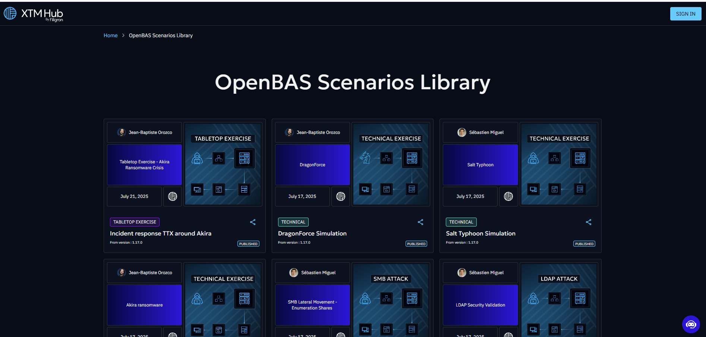
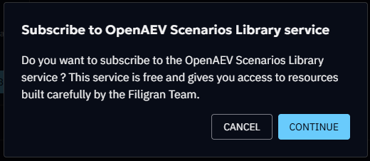
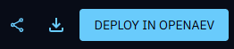

# OpenAEV Scenarios Library

A comprehensive library of OpenAEV scenarios is now available on the XTM Hub, 
providing seamless access to curated scenarios data. 
Currently, the library focuses on OpenAEV scenarios that can be directly deployed to OpenAEV platforms and created by our Filigran Team.



## Overview
The XTM Hub OpenAEV scenarios library represents a significant advancement in adversarial exposure validation accessibility. 
The library features pre-built scenarios that have been curated by the Filigran team, 
ensuring high-quality, relevant threat intelligence data.
Organizations can benefit from one-click deployment capabilities that integrate directly with registered OpenAEV platforms, 
while maintaining completely free access without any cost barriers. 
Additionally, the platform supports public browsing, allowing users to explore available scenarios without requiring authentication.

## Getting Started
### Initial Subscription
Before accessing the full functionality of the OpenAEV scenario library, 
your organization must complete a one-time subscription process. 
A designated person from your organization needs to subscribe to the library, 
which is completely free and serves as an enablement step for all subsequent users. 
Once this initial subscription is completed, all users from your organization will 
gain automatic access to the full range of services without any additional steps or recurring costs.




### Accessing the Library
The XTM Hub provides two distinct access methods to accommodate different user needs. 
Authenticated access offers the complete feature set, 
including the ability to browse and download OpenAEV scenarios, 
deploy feeds directly to OpenAEV platforms, 
and access detailed feed information and metadata. 
For users who prefer to explore before committing, 
public access provides read-only capabilities through the cybersecurity-solutions portal, 
where the complete library catalog can be viewed along with feed descriptions and 
details without requiring any connection or subscription.

## Working with OpenAEV scenarios
### Feed Exploration
The XTM Hub provides comprehensive information when you interact with any scenario tile in the library. 
Each scenario includes detailed specifications and content descriptions to help you make informed decisions about integration. 
Download options are readily available for users who prefer manual import processes, 
while sharing capability allow you to generate shareable links that facilitate easy 
collaboration with team members and external partners.

### Manual Import to OpenAEV
Organizations that prefer traditional import methods can 
easily download desired OpenAEV scenarios from the library and manually integrate them
into their OpenAEV platforms. This process involves downloading the scenario, 
navigating to your OpenAEV platform, and using the standard Import functionality 
to upload and configure the feed according to your specific requirements. 

### One-Click Deployment
The streamlined deployment process represents the most efficient method for integrating scenarios
into your OpenAEV platform (available from OpenAEV X.X.X).
Before utilizing this functionality, your OpenAEV platform must be properly registered in the XTM Hub (see [OpenAEV registration documentation](/user/openaev-registration)),
and your user account must possess the necessary UPDATE and CREATE permissions for scenarios within OpenAEV. 
The deployment process is straightforward: select your desired scenario tile, click the ```Deploy in OpenAEV``` button, 
choose your target platform if multiple platforms are registered, 
and wait a few seconds until successful integration is confirmed in your OpenAEV platform. You will see the new scenario in the list. 

### Sharing and Collaboration
The XTM Hub facilitates seamless collaboration through its comprehensive sharing functionality. 
Users can generate universal links for any OpenAEV scenario, enabling cross-organization sharing with partners, 
clients, or team members without requiring recipients to maintain XTM Hub accounts. 
This approach removes barriers to information sharing while maintaining the integrity and
accessibility of threat intelligence data across different organizational boundaries.



## Technical Requirements and Best Practices
Successful integration with the XTM Hub requires attention to several technical considerations. 
Users deploying feeds must maintain appropriate OpenAEV permissions, 
including UPDATE/CREATE capability for OpenAEV scenarios. 
Platform registration involves enrolling OpenAEV platforms in the XTM Hub.