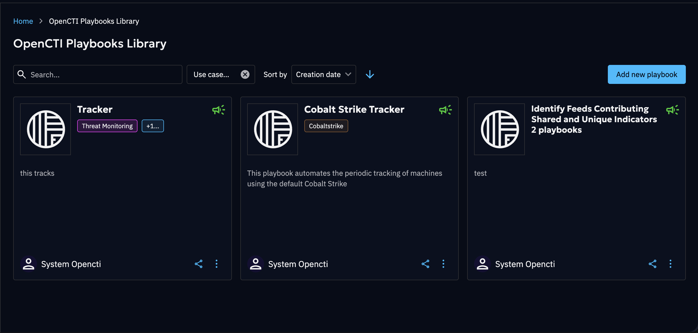

# OpenCTI Playbooks Library

A comprehensive library of playbooks is now available on the XTM Hub,
providing seamless access to curated automation workflows.
Currently, the library focuses on playbooks that can be directly deployed to OpenCTI platforms and created by our Filigran Team.

## Overview

The XTM Hub playbooks library represents a significant advancement in threat intelligence automation accessibility.
The library features pre-built playbooks that have been curated by the Filigran team,
ensuring high-quality, relevant automation content.
Organizations running OpenCTI Enterprise Edition can benefit from one-click deployment capabilities that integrate directly with their registered OpenCTI platforms,
while all users maintain completely free access to browse and download playbooks without any cost barriers.
Additionally, the platform supports public browsing, allowing users to explore available playbooks without requiring authentication.

## Getting Started

### Accessing the Library

The XTM Hub provides two distinct access methods to accommodate different user needs.
Authenticated access offers the complete feature set,
including the ability to browse and download playbooks,
deploy playbooks directly to OpenCTI Enterprise Edition platforms,
and access detailed playbook information and metadata.
For users who prefer to explore before committing,
public access provides read-only capabilities through the [Hub public portal](https://hub.filigran.io/),
where the complete library catalog can be viewed along with playbook descriptions and
details without requiring any connection or subscription.

The first time a member of your organization opens the OpenCTI Playbooks Library tile from the Hub home page,
your organization is automatically subscribed to the service in one step.
Subscription is free and instantly grants access to all users in your organization without any additional steps or recurring costs.

## Working with Playbooks

### Playbook Exploration

The XTM Hub provides comprehensive information when you interact with any playbook tile in the library.
Each playbook includes detailed specifications and content descriptions to help you make informed decisions about integration.
Download options are readily available for users who prefer manual import processes,
while sharing capability allow you to generate shareable links that facilitate easy
collaboration with team members and external partners.

The playbooks library offers several filters to help you find the playbook that best suits your needs.
You can search by name and filter playbooks by use case to quickly locate relevant automation content.

### Manual Import to OpenCTI

Organizations that prefer traditional import methods can
easily download desired playbooks from the library and manually integrate them
into their OpenCTI platforms. This process involves downloading the playbook JSON file,
navigating to your OpenCTI platform under `Data → Processing → Automation`, and using the standard Import functionality
to upload and configure the playbook according to your specific requirements.

### One-Click Deployment (OpenCTI Enterprise Edition only)

The streamlined deployment process represents the most efficient method for integrating library playbooks
into your OpenCTI platform. **This functionality requires an OpenCTI Enterprise Edition license.**

Before utilizing this functionality, the following prerequisites must be met:

- Your OpenCTI platform must be properly registered in the XTM Hub (see [OpenCTI registration documentation](../user/opencti-registration.md)).
- The target platform must run an **Enterprise Edition** license.
- Your user account must possess the necessary CREATE and UPDATE permissions for playbooks within OpenCTI.

The deployment process is straightforward: select your desired playbook, click the `Deploy in OpenCTI` button,
choose your target platform if multiple platforms are registered,
and wait a few seconds until you are redirected to your OpenCTI platform where the playbook is created and ready to use.

If none of your registered OpenCTI platforms is running an Enterprise Edition license,
the `Deploy in OpenCTI` button is displayed with an **[EE]** badge.
Clicking the badge opens a side panel that explains the Enterprise Edition feature and lets you contact our sales team to learn more.
In this case, you can still download the playbook JSON file and import it manually following the steps described above.

### Sharing and Collaboration

The XTM Hub facilitates seamless collaboration through its comprehensive sharing functionality.
Users can generate universal links for any playbook, enabling cross-organization sharing with partners,
clients, or team members without requiring recipients to maintain XTM Hub accounts.
This approach removes barriers to information sharing while maintaining the integrity and
accessibility of automation content across different organizational boundaries.

## Technical Requirements and Best Practices

Successful integration with the XTM Hub requires attention to several technical considerations.
Users deploying playbooks must maintain appropriate OpenCTI permissions,
including CREATE/UPDATE capability for playbooks.
Platform registration involves enrolling OpenCTI platforms in the XTM Hub,
and one-click deployment additionally requires an OpenCTI Enterprise Edition license on the target platform.
