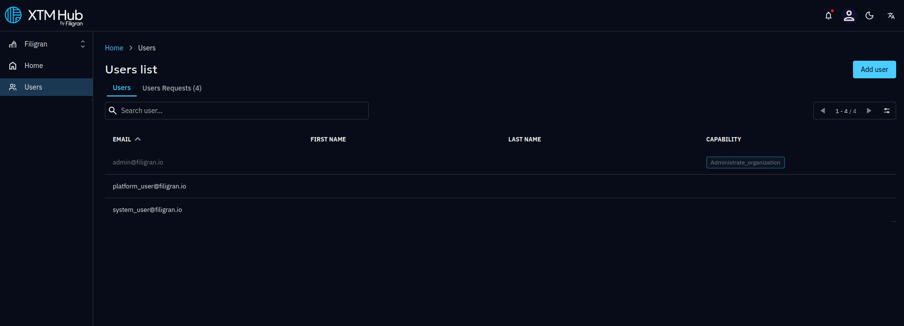
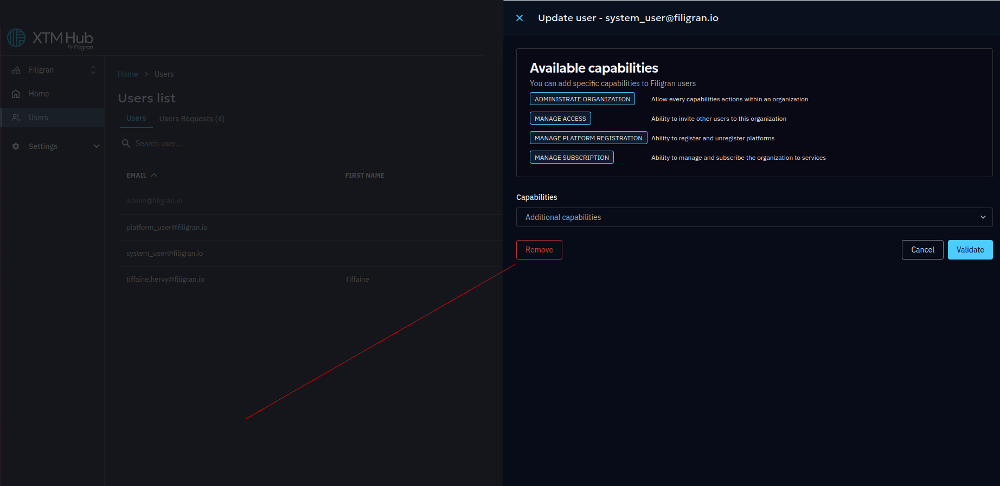
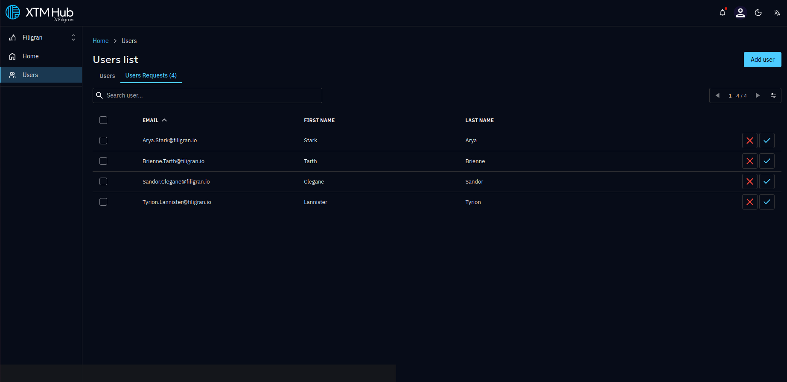
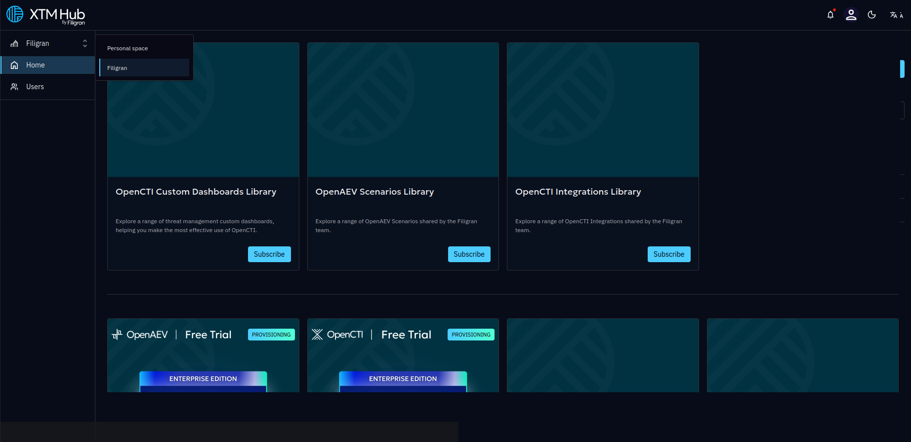

# Manage Your Organization

By default, the first user who logs in to the XTM Hub becomes the **Organization Administrator**.

This user is automatically granted the **ADMINISTRATE ORGANIZATION** capability, which provides full access to all organization features and permissions.

## Manage Team Members

As an Organization Administrator, you can manage users, their access rights, and their membership within the organization.

### Access the Users Page

1. Open the main menu.
2. Click **Users**.
3. View the list of all users in your organization and their assigned capabilities.

## Manage User Capabilities

Administrators can update capabilities for any team member. They cannot update their own capabilities.

### To Modify a User’s Capabilities

1. Go to the **Users** page.
2. Select the user you want to edit.
3. Review the list of available capabilities.
4. Enable or disable the required capabilities.
5. Click **Validate** to save your changes.

### Available Capabilities

- **ADMINISTRATE ORGANIZATION**  
  Grants full access to all organization capabilities and settings.

- **MANAGE ACCESS**  
  Allows the user to invite new members to the organization.

- **MANAGE PLATFORM REGISTRATION**  
  Allows the user to register and unregister platforms.

- **MANAGE SUBSCRIPTION**  
  Allows the user to manage and subscribe the organization to services.

> ⚠️ Users with the **ADMINISTRATE ORGANIZATION** capability automatically have access to all other capabilities.

## Remove Team Members from the Organization

The Organization Administrator can remove a user from the organization.

### To Remove a User

1. Go to the **Users** page.
2. Select the user you want to remove.
3. Scroll to the bottom of the user details panel.
4. Click the red **Remove** button.

The user will still have access to the XTM Hub but will no longer belong to this organization.  
They may still have access to their personal space or other organizations.

## Approve New Team Members

When a new user logs in to the XTM Hub and their email domain matches the administrator’s domain, they are marked as a **Pending User**.

The Organization Administrator must approve their request before they can join the organization.

### To Approve a User

1. Click on the notification bell in the navigation bar.
2. Go to the **Users** page.
3. Open the **User Requests** tab.
4. Review and approve pending requests.

You can click user by user if you're not sure, but don't hesitate to click them all!

Every Monday at 9:00 AM (Paris' time), a summary email is sent to the administrator listing all pending user requests that have not yet been approved.

# Personal Space

The **Personal Space** is a special type of organization designed for individual use.

- You are the only member.
- You cannot invite other users.
- You cannot start a product trial from this space.

However, it is fully configurable and intended to give you flexibility for personal use.

To go on this personal space, click on your organization top left and select the one you want to work on.

