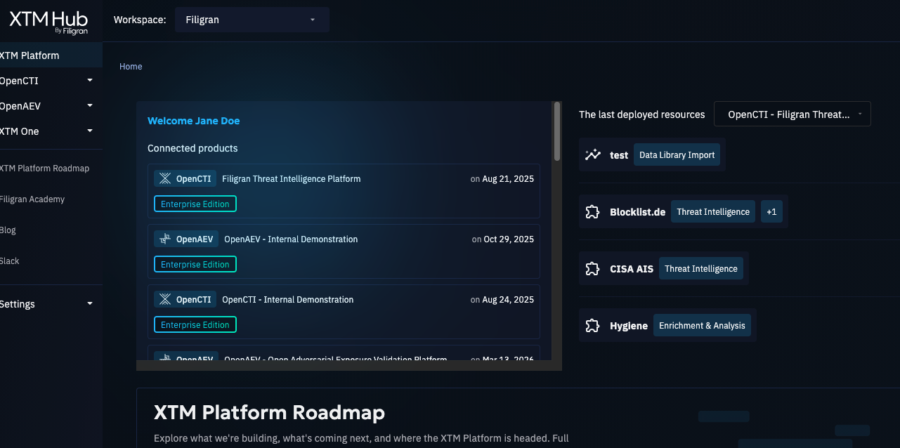
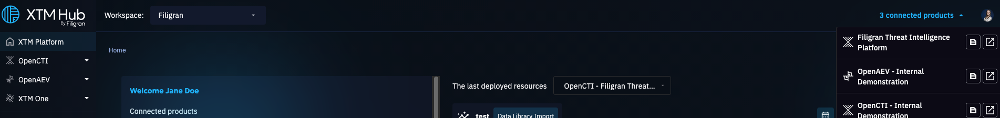

# OpenAEV Product Connection

To utilize features such as one-click deployments, your OpenAEV product must be connected (available from OpenAEV 2.0.0).

The connection process is initiated from your OpenAEV product. For more detailed information, please refer to the [OpenAEV documentation](https://docs.openaev.io/latest/administration/hub).
You can also connect your product from the XTM Hub from different places:

- From the header in the top right corner, click on "X connected products" and then click "Connect your product +"

- From the homepage if you do not have any product connected, click on the blue button "Connect your product +"

- From libraries, when you try one click deploy and have no product connected, you are able to connect directly from there.

To connect from Hub, you just need your product URL, XTM Hub takes care of the rest!

## View a list of your connected OpenAEV products

You can access a list of your connected OpenAEV products on the homepage.

To locate a specific product, look under the organization where it was initially connected. You will see a tile on which you can click on to access the newly connected product.

You can also have access to your connected products anywhere from the header in the top right corner.

The product's name is derived directly from the title of your OpenAEV product. You can edit it on the product's page on XTM Hub or during the connection process.