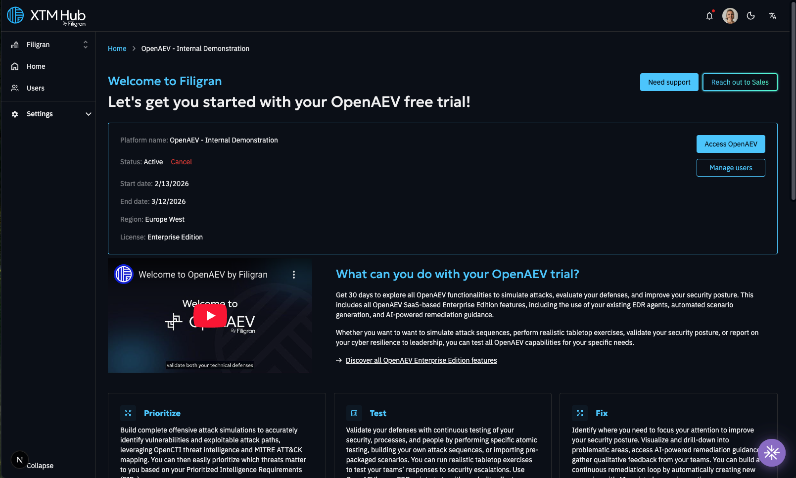
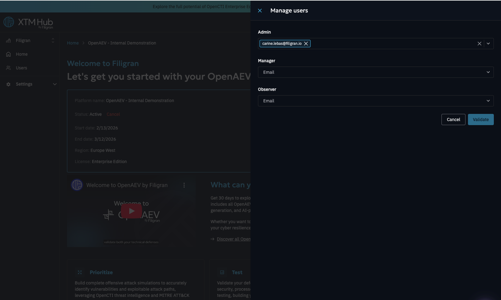

# Free trials

## Start an OpenAEV free trial

Starting a trial gives users access to a dedicated OpenAEV Enterprise Edition platform for 30 days.
Each organization is generally entitled to only one free trial. Trials cannot be started for personal organizations.

If Filigran does not have enough capacity to host the trial in the requested region, the user will be notified and 
may either select a different region or join a waiting list for the preferred region.

### Trial Statuses

The status of a trial is shown on its details page. It can be one of the following:

| Status       | Description                                                                                                                        |
|--------------|------------------------------------------------------------------------------------------------------------------------------------|
| Active       | The trial is on-going                                                                                                              | 
| Pending      | The trial request has been submitted and is awaiting internal validation to be deployed.                                           |
| Provisioning | The trial request is getting provisioned.                                                                                          |
| Requested    | Trial quotas have been reached.  The trial is placed on a waiting list and user will be notified once a slot becomes available. |                                                                                                                           |
| Cancelled    | The trial has been cancelled.                                                                                                      |
| Failed       | The trial provisioning failed due to some technical reasons.                                                                       |
| Expired      | The trial period has ended and access is no longer active.                                                                         |

### Enterprise License

The trial comes with an EE license, with all the EE functionalities from OpenAEV: 

[OpenAEV Enterprise Documentation](https://docs.openaev.io/latest/administration/enterprise/?h=enterprise)

### Trial Duration

All standard trials last **30 days**. The trial’s start and end dates are displayed on the trial's details page.

### Cancellation
You can cancel your free trial at any time from the trial details page.
If the trial has not yet reached **Active** status, you will be able to request a new one.
If Filigran encounters operational capacity limitations, your trial might be cancelled before its scheduled end date.

## Contact Us

Selecting **Contact Us**, from XTM-HUB, or from the free trial platform, sends the user’s inquiry directly to our **Sales team**.

Use this option for questions related to licensing, enterprise packages, pricing, or expansions.

## Connection on your OpenAEV free trial

Once OpenAEV is activated, administrators in your organization will have the ability to grant access to other users. By default, the user requesting the trial will be assigned the admin role.

On this page, click on "Manage Users" to open a drawer where you can assign roles to users within your organization.

Only users with an assigned role will be able to access the free trial instance.
After assigning roles, users can log in using the same credentials as their XTM Hub account.

### User Group Mapping (Hub → OpenAEV)!
To ensure consistent permissions across systems, user roles in XTM Hub map directly to your OpenAEV free trial roles:

- **Admin**: The administrator role with full access to platform settings, configuration, and management.
  Admins can manage users, roles, and system-wide settings, in addition to having full visibility and control over the elements.

- **Manager**: A role with full capabilities to manage and run any type of scenario.
  Manager can modify any element in the platform but do not have access to platform settings, administration, or configuration options.

- **Observer**: A read-only role that allows access to view all elements in the platform without the ability to make any modifications.
  Ideal for users who only need to consume information.