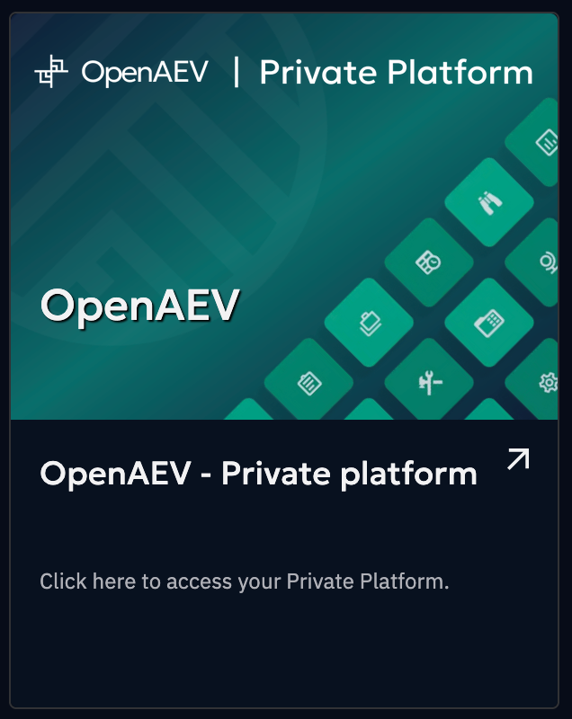

# OpenAEV Platform Registration

To utilize features such as one-click deployments, your OpenAEV product must be registered (available from OpenAEV 2.0.0).

The registration process is initiated from your OpenAEV product. For more detailed information, please refer to the [OpenAEV documentation](https://docs.openaev.io/latest/administration/hub).

## View a list of your registered OpenAEV platforms

You can access a list of your registered OpenAEV platforms, along with the services you've subscribed to.

To locate a specific product, look under the organization where it was initially registered. You will see a tile on which you can click on to access the newly registered product.

The product's name is derived directly from the title of your OpenAEV product.