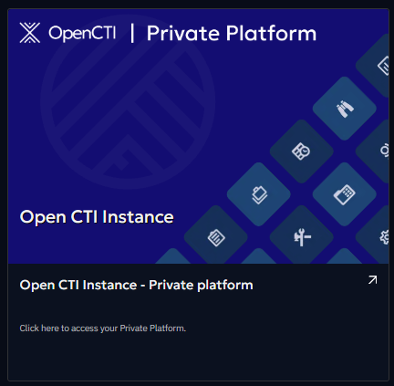

# OpenCTI Platform Registration

To utilize features such as one-click deployments, your OpenCTI product must be registered (available from OpenCTI 6.7.10). 

The registration process is initiated from your OpenCTI product. For more detailed information, please refer to the [OpenCTI documentation](https://docs.opencti.io/latest/administration/hub).

## View a list of your registered OpenCTI platforms

You can access a list of your registered OpenCTI platforms, along with the services you've subscribed to. 

To locate a specific product, look under the organization where it was initially registered. You will see a tile on which you can click on to access the newly registered product.

The product's name is derived directly from the title of your OpenCTI product.